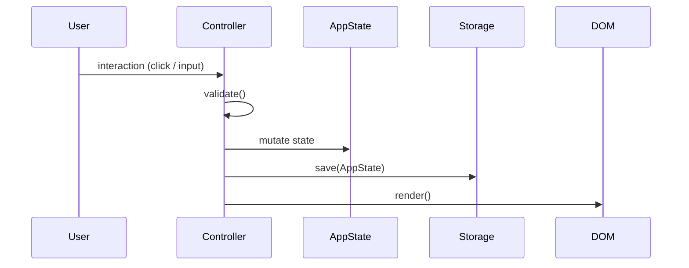
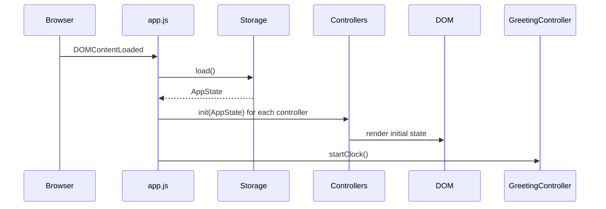

# Design Document: To-Do List Life Dashboard

## Overview

The To-Do List Life Dashboard is a zero-dependency, single-page web application delivered as three files: `index.html`, `css/style.css`, and `js/app.js`. It runs entirely in the browser with no build step, no framework, and no backend — all state is persisted in `localStorage`.

The application is composed of four functional widgets arranged in a responsive grid:

1. **Greeting Widget** — live clock, date, and time-of-day greeting with optional user name.
2. **Focus Timer** — Pomodoro-style countdown timer with configurable duration.
3. **Task Manager** — full CRUD task list with sorting and duplicate detection.
4. **Quick Links** — a personal URL launcher with label/URL validation.

A global Light/Dark theme toggle applies a `data-theme` attribute to `<html>`, driving all colour changes through CSS custom properties. The visual design uses an elegant **Aurora** aesthetic — deep jewel-tone backgrounds, soft glassmorphism cards, and a purple-to-indigo accent gradient that feels premium without being heavy.

### Key Design Decisions

- **No framework**: Vanilla JS keeps the bundle to a single file and eliminates dependency risk. DOM manipulation is explicit and traceable.
- **Single source of truth in `localStorage`**: All widgets read from and write to a shared `AppState` object. This avoids synchronisation bugs between in-memory state and persisted state.
- **CSS custom properties for theming**: Switching themes requires only one attribute change on `<html>`; no class toggling or style injection needed.
- **Module pattern via IIFEs / object literals**: Because there is only one JS file, logical separation is achieved through named controller objects (`GreetingController`, `TimerController`, `TaskController`, `LinksController`, `ThemeController`) that each own their DOM references and event listeners.

---

## Visual Theme: Aurora

The dashboard uses an **Aurora** design language — a premium, eye-catching aesthetic built entirely with CSS custom properties, no external fonts or icon libraries required (system font stack only).

### Design Principles

- **Glassmorphism cards**: Widget panels use `backdrop-filter: blur()` with a semi-transparent background, giving a frosted-glass depth effect over the page background.
- **Gradient accents**: A purple → indigo → violet gradient (`#7c3aed → #4f46e5 → #7c3aed`) is used for primary buttons, the timer ring, and focus highlights.
- **Subtle animations**: Hover lifts (`transform: translateY(-2px)`), smooth transitions (200–300ms ease), and a pulsing ring on the running timer add life without distraction.
- **Typography**: System font stack (`-apple-system, BlinkMacSystemFont, 'Segoe UI', sans-serif`) for fast load. The clock uses a large, light-weight numeral (`font-weight: 300`, `font-size: clamp(3rem, 8vw, 6rem)`) for visual impact.
- **Spacing**: Generous padding (24–32px inside cards) and a consistent 8px base grid keep the layout breathable.

### Light Theme — "Pearl Aurora"

| Token | Value | Usage |
|---|---|---|
| `--bg-page` | `#f0f0f7` | Page background (cool off-white) |
| `--bg-card` | `rgba(255,255,255,0.72)` | Glassmorphism card fill |
| `--bg-card-border` | `rgba(255,255,255,0.9)` | Card border highlight |
| `--text-primary` | `#1a1a2e` | Headings, clock digits |
| `--text-secondary` | `#4a4a6a` | Labels, secondary copy |
| `--text-muted` | `#8888aa` | Placeholders, timestamps |
| `--accent-start` | `#7c3aed` | Gradient start (purple) |
| `--accent-end` | `#4f46e5` | Gradient end (indigo) |
| `--accent-solid` | `#6d28d9` | Solid accent (buttons, checkboxes) |
| `--accent-hover` | `#5b21b6` | Hover state for accent elements |
| `--success` | `#059669` | Completed task indicator |
| `--danger` | `#dc2626` | Delete button, error messages |
| `--warning` | `#d97706` | Duplicate warning |
| `--shadow-card` | `0 8px 32px rgba(99,102,241,0.12)` | Card drop shadow |
| `--shadow-hover` | `0 16px 48px rgba(99,102,241,0.22)` | Elevated card on hover |
| `--blur` | `16px` | backdrop-filter blur amount |

### Dark Theme — "Midnight Aurora"

| Token | Value | Usage |
|---|---|---|
| `--bg-page` | `#0d0d1a` | Deep navy-black page background |
| `--bg-card` | `rgba(255,255,255,0.06)` | Glassmorphism card fill |
| `--bg-card-border` | `rgba(255,255,255,0.12)` | Card border highlight |
| `--text-primary` | `#f0f0ff` | Headings, clock digits |
| `--text-secondary` | `#b0b0d0` | Labels, secondary copy |
| `--text-muted` | `#6060a0` | Placeholders, timestamps |
| `--accent-start` | `#a78bfa` | Gradient start (soft violet) |
| `--accent-end` | `#818cf8` | Gradient end (soft indigo) |
| `--accent-solid` | `#8b5cf6` | Solid accent |
| `--accent-hover` | `#7c3aed` | Hover state |
| `--success` | `#34d399` | Completed task indicator |
| `--danger` | `#f87171` | Delete button, error messages |
| `--warning` | `#fbbf24` | Duplicate warning |
| `--shadow-card` | `0 8px 32px rgba(0,0,0,0.4)` | Card drop shadow |
| `--shadow-hover` | `0 16px 48px rgba(139,92,246,0.3)` | Elevated card on hover |
| `--blur` | `20px` | backdrop-filter blur amount |

### Page Background

Both themes use a subtle radial gradient mesh behind the cards to create depth:

```css
/* Light */
background: radial-gradient(ellipse at 20% 50%, rgba(124,58,237,0.08) 0%, transparent 60%),
            radial-gradient(ellipse at 80% 20%, rgba(79,70,229,0.08) 0%, transparent 60%),
            var(--bg-page);

/* Dark */
background: radial-gradient(ellipse at 20% 50%, rgba(124,58,237,0.15) 0%, transparent 60%),
            radial-gradient(ellipse at 80% 20%, rgba(79,70,229,0.15) 0%, transparent 60%),
            var(--bg-page);
```

### Timer Ring

The Focus Timer displays a circular SVG progress ring around the MM:SS digits. The ring stroke uses the accent gradient and animates `stroke-dashoffset` as the timer counts down, giving a satisfying visual countdown arc.

### Button Styles

| Variant | Style |
|---|---|
| Primary (Start, Add, Save) | Gradient fill (`accent-start → accent-end`), white text, 8px radius, subtle box-shadow |
| Secondary (Stop, Cancel) | Transparent fill, accent-coloured border and text |
| Danger (Delete) | Transparent fill, `--danger` coloured icon/text, appears on hover of the row |
| Icon-only (Theme toggle, Edit) | Circular, 36×36px, semi-transparent background |

### Card Layout

```
┌─────────────────────────────────────────────┐
│  ░░░░░░░░░░░░░░░░░░░░░░░░░░░░░░░░░░░░░░░░  │  ← blur backdrop
│  ┌─────────────────────────────────────┐    │
│  │  Widget heading          [icon btn] │    │  ← card header
│  ├─────────────────────────────────────┤    │
│  │                                     │    │
│  │  Widget content                     │    │  ← card body
│  │                                     │    │
│  └─────────────────────────────────────┘    │
└─────────────────────────────────────────────┘
```

Cards have `border-radius: 20px`, a 1px border using `--bg-card-border`, and `box-shadow: var(--shadow-card)`. On hover they lift with `transform: translateY(-2px)` and `box-shadow: var(--shadow-hover)`.

### Responsive Grid

```
≥ 1024px  →  2-column grid: [Greeting + Timer] | [Tasks + Links]
640–1023px →  2-column grid: [Greeting] [Timer] stacked above [Tasks] [Links]
< 640px   →  single column, full-width cards
```

---

## Architecture

The application follows a simple **Controller → State → DOM** flow:

```
User Interaction
      │
      ▼
Widget Controller  ──writes──▶  AppState (in-memory)
      │                               │
      │                         persists to
      │                               │
      │                         localStorage
      │
      └──renders──▶  DOM
```

There is no reactive framework. Each controller exposes an `init()` function called once on `DOMContentLoaded`, and a `render()` function that rebuilds its section of the DOM from the current in-memory state. State mutations always follow this sequence:

1. Validate input.
2. Mutate the in-memory `AppState`.
3. Call `Storage.save()` to persist.
4. Call the relevant `render()` to update the DOM.



### Startup Sequence



---

## Components and Interfaces

### File / Folder Structure

```
/
├── index.html
├── css/
│   └── style.css
└── js/
    └── app.js
```

### index.html Structure

```html
<!DOCTYPE html>
<html lang="en" data-theme="light">
<head>
  <meta charset="UTF-8" />
  <meta name="viewport" content="width=device-width, initial-scale=1.0" />
  <title>Life Dashboard</title>
  <link rel="stylesheet" href="css/style.css" />
</head>
<body>
  <header class="app-header">
    <div id="greeting-widget">...</div>
    <div class="header-controls">
      <button id="theme-toggle" aria-label="Toggle dark mode">🌙</button>
    </div>
  </header>

  <main class="dashboard-grid">
    <section id="timer-widget"   aria-labelledby="timer-heading">...</section>
    <section id="task-widget"    aria-labelledby="task-heading">...</section>
    <section id="links-widget"   aria-labelledby="links-heading">...</section>
  </main>

  <script src="js/app.js"></script>
</body>
</html>
```

### JavaScript Controllers

Each controller is a plain object literal with a consistent interface:

```
ControllerName = {
  init()    → void   // bind DOM refs, attach event listeners, call render()
  render()  → void   // rebuild DOM from current AppState
}
```

| Controller | Responsibilities |
|---|---|
| `ThemeController` | Read/write theme from `AppState`, toggle `data-theme` on `<html>`, update toggle button label |
| `GreetingController` | Render time/date/greeting, manage `setInterval` clock tick, handle name input save |
| `TimerController` | Manage timer state machine (stopped / running / paused), `setInterval` countdown, control button states |
| `TaskController` | Render task list, handle add/edit/delete/toggle/sort, duplicate detection |
| `LinksController` | Render link buttons, handle add/delete, URL validation |

### Storage Module

```javascript
const Storage = {
  KEY: 'lifeDashboard_v1',
  load()       → AppState,   // JSON.parse from localStorage, or return defaultState()
  save(state)  → void,       // JSON.stringify and write to localStorage
  defaultState() → AppState  // returns a fresh AppState with all defaults
}
```

### Greeting Controller Interface

```javascript
const GreetingController = {
  init()         → void,
  render()       → void,
  startClock()   → void,   // setInterval every 1000ms → updateClock()
  updateClock()  → void,   // reads Date(), updates time/date/greeting DOM nodes
  getGreeting(hour: number) → string,  // pure function: hour → greeting string
  saveName(name: string)   → void      // trim, validate length, persist, re-render
}
```

### Timer Controller Interface

```javascript
const TimerController = {
  // State machine: 'stopped' | 'running' | 'paused'
  state: 'stopped',
  intervalId: null,

  init()           → void,
  render()         → void,
  start()          → void,   // transition to 'running', start setInterval
  stop()           → void,   // transition to 'paused', clear setInterval
  reset()          → void,   // transition to 'stopped', restore full duration
  tick()           → void,   // decrement remaining seconds; if 0 → onComplete()
  onComplete()     → void,   // alert/audio cue, transition to 'stopped'
  saveDuration(minutes: number) → void,  // validate 1–120, persist, reset timer
  formatTime(seconds: number)   → string // pure function: seconds → "MM:SS"
}
```

### Task Controller Interface

```javascript
const TaskController = {
  currentSort: 'default',

  init()                          → void,
  render()                        → void,
  addTask(title: string)          → void,
  editTask(id: string, newTitle: string) → void,
  deleteTask(id: string)          → void,
  toggleTask(id: string)          → void,
  setSort(option: SortOption)     → void,
  getSortedTasks()                → Task[],  // pure function, does not mutate state
  isDuplicate(title: string, excludeId?: string) → boolean
}
```

### Links Controller Interface

```javascript
const LinksController = {
  init()                                    → void,
  render()                                  → void,
  addLink(label: string, url: string)       → void,
  deleteLink(id: string)                    → void,
  isValidUrl(url: string)                   → boolean  // checks http:// or https://
}
```

---

## Data Models

All data is stored as a single JSON object under the key `lifeDashboard_v1` in `localStorage`.

### AppState

```javascript
{
  theme: 'light' | 'dark',          // default: 'light'
  userName: string,                  // default: ''
  pomodoroDuration: number,          // minutes, default: 25, range: 1–120
  tasks: Task[],                     // default: []
  links: Link[]                      // default: []
}
```

### Task

```javascript
{
  id: string,          // crypto.randomUUID() or Date.now().toString()
  title: string,       // trimmed, non-empty
  completed: boolean,  // default: false
  createdAt: number    // Date.now() timestamp (ms since epoch)
}
```

### Link

```javascript
{
  id: string,    // crypto.randomUUID() or Date.now().toString()
  label: string, // non-empty display text
  url: string    // must start with 'http://' or 'https://'
}
```

### SortOption (enum-like string union)

```javascript
'default'        // order by createdAt ascending
'az'             // alphabetical ascending, case-insensitive
'za'             // alphabetical descending, case-insensitive
'completedLast'  // incomplete first, then complete; each group by createdAt
```

### Timer Runtime State (in-memory only, not persisted)

```javascript
{
  status: 'stopped' | 'running' | 'paused',
  remainingSeconds: number,   // current countdown value
  intervalId: number | null   // return value of setInterval
}
```

---

## Correctness Properties

*A property is a characteristic or behavior that should hold true across all valid executions of a system — essentially, a formal statement about what the system should do. Properties serve as the bridge between human-readable specifications and machine-verifiable correctness guarantees.*

### Property 1: Greeting time-of-day correctness

*For any* hour value in the range 0–23, `getGreeting(hour)` SHALL return exactly one of "Good Morning", "Good Afternoon", "Good Evening", or "Good Night", and the returned string SHALL match the boundary rules defined in Requirements 1.3–1.6.

**Validates: Requirements 1.3, 1.4, 1.5, 1.6**

---

### Property 2: Timer format round-trip

*For any* integer number of seconds in the range 0–7200 (0 to 120 minutes), `formatTime(seconds)` SHALL return a string of the form `MM:SS` where `MM` and `SS` are zero-padded two-digit integers, and parsing that string back as `minutes * 60 + seconds` SHALL yield the original input value.

**Validates: Requirements 3.1, 4.1**

---

### Property 3: Task addition grows the list

*For any* task list and any valid (non-empty, non-duplicate) task title, calling `addTask(title)` SHALL result in the task list length increasing by exactly one, and the new task SHALL appear in the list with the trimmed title, `completed: false`, and a `createdAt` timestamp.

**Validates: Requirements 5.2, 5.5**

---

### Property 4: Whitespace and empty task titles are rejected

*For any* string composed entirely of whitespace characters (including the empty string), calling `addTask(title)` SHALL NOT increase the task list length, and the task list SHALL remain unchanged.

**Validates: Requirements 5.4**

---

### Property 5: Duplicate task titles are rejected

*For any* task list containing at least one task, attempting to add a title that matches an existing task title (after trimming and case-insensitive comparison) SHALL NOT create a new task, and the task list length SHALL remain unchanged.

**Validates: Requirements 5.3, 6.4**

---

### Property 6: Task completion toggle is an involution

*For any* task, toggling its completion status twice SHALL return the task to its original completion state (i.e., `toggle(toggle(task.completed)) === task.completed`).

**Validates: Requirements 7.2**

---

### Property 7: Sort does not mutate stored data

*For any* task list and any sort option, calling `getSortedTasks()` SHALL return a new array with the same tasks in the specified order, and the underlying `AppState.tasks` array SHALL remain in its original insertion order.

**Validates: Requirements 8.2**

---

### Property 8: Sort ordering correctness

*For any* task list:
- Under `'az'` sort, *for any* two adjacent tasks in the result, the first task's title SHALL be lexicographically ≤ the second task's title (case-insensitive).
- Under `'za'` sort, the first task's title SHALL be lexicographically ≥ the second task's title (case-insensitive).
- Under `'completedLast'` sort, *for any* incomplete task and *any* complete task in the result, the incomplete task SHALL appear at a lower index than the complete task.
- Under `'default'` sort, *for any* two adjacent tasks, the first task's `createdAt` SHALL be ≤ the second task's `createdAt`.

**Validates: Requirements 8.3, 8.4, 8.5, 8.6**

---

### Property 9: AppState serialisation round-trip

*For any* valid `AppState` object, serialising it with `JSON.stringify` and then deserialising with `JSON.parse` SHALL produce an object that is deeply equal to the original.

**Validates: Requirements 2.2, 4.2, 5.5, 7.2, 9.2, 10.2, 11.3**

---

### Property 10: URL validation correctness

*For any* string, `isValidUrl(url)` SHALL return `true` if and only if the string begins with `http://` or `https://` (case-sensitive prefix match).

**Validates: Requirements 9.2, 9.3**

---

### Property 11: User name truncation

*For any* string stored as `userName`, the value displayed in the greeting SHALL be at most 50 characters long.

**Validates: Requirements 2.5**

---

### Property 12: Pomodoro duration validation

*For any* integer input to `saveDuration`, the function SHALL accept the value if and only if it is in the inclusive range [1, 120], and SHALL reject all values outside that range without modifying `AppState.pomodoroDuration`.

**Validates: Requirements 4.1, 4.5**

---

## Error Handling

### Input Validation

All validation is performed in the controller before any state mutation. Inline error messages are rendered adjacent to the relevant input field and cleared on the next valid submission or when the input changes.

| Scenario | Behaviour |
|---|---|
| Empty / whitespace task title | Show inline message: "Task title cannot be empty." |
| Duplicate task title | Show inline message: "A task with this title already exists." |
| Empty link label | Show inline message: "Label cannot be empty." |
| Invalid link URL | Show inline message: "URL must start with http:// or https://" |
| Pomodoro duration out of range | Show inline message: "Duration must be between 1 and 120 minutes." |
| User name > 50 chars | Silently truncate to 50 characters on save. |

### localStorage Errors

`Storage.load()` wraps `JSON.parse` in a `try/catch`. If parsing fails (corrupted data), it returns `Storage.defaultState()` and logs a warning to the console. `Storage.save()` similarly wraps `localStorage.setItem` to handle `QuotaExceededError` gracefully, logging the error without crashing the app.

### Timer Edge Cases

- If `setInterval` fires while the tab is hidden (Page Visibility API), the timer may drift. This is acceptable for a personal productivity tool; no correction mechanism is required.
- `onComplete()` uses `window.alert()` as the primary notification. If the browser blocks alerts, the timer still transitions to `stopped` state correctly.

---

## Testing Strategy

> **Note:** Per project constraints, no test files are to be generated. This section documents the intended testing approach for reference and future implementation.

### Unit Tests (Example-Based)

Focus on specific, concrete scenarios:

- `getGreeting(hour)` returns correct string for each of the four time bands and at each boundary hour (5, 12, 18, 22, 0).
- `formatTime(0)` → `"00:00"`, `formatTime(90)` → `"01:30"`, `formatTime(7200)` → `"120:00"`.
- `isValidUrl("https://example.com")` → `true`; `isValidUrl("ftp://x")` → `false`; `isValidUrl("")` → `false`.
- `Storage.load()` returns `defaultState()` when `localStorage` is empty or contains invalid JSON.
- Timer state machine transitions: stopped→running, running→paused, paused→running, running→stopped (on complete), any→stopped (reset).
- Duplicate detection: case-insensitive match, leading/trailing whitespace normalisation.

### Property-Based Tests

If a property-based testing library (e.g., [fast-check](https://github.com/dubzzz/fast-check) for JavaScript) is introduced in the future, the Correctness Properties above map directly to test cases:

- **Property 1**: Generate `hour` in [0, 23]; assert `getGreeting(hour)` matches the correct band.
- **Property 2**: Generate `seconds` in [0, 7200]; assert `formatTime` output parses back to the original value.
- **Property 3**: Generate task lists and valid titles; assert list grows by exactly one.
- **Property 4**: Generate whitespace-only strings; assert list is unchanged.
- **Property 5**: Generate task lists with at least one task; assert duplicate titles are rejected.
- **Property 6**: Generate tasks; assert double-toggle is identity.
- **Property 7**: Generate task lists and sort options; assert `getSortedTasks()` does not mutate `AppState.tasks`.
- **Property 8**: Generate task lists; assert ordering invariants hold for each sort option.
- **Property 9**: Generate `AppState` objects; assert JSON round-trip produces deep equality.
- **Property 10**: Generate arbitrary strings; assert `isValidUrl` matches the `http(s)://` prefix rule.
- **Property 11**: Generate strings of arbitrary length; assert displayed name is ≤ 50 chars.
- **Property 12**: Generate integers; assert `saveDuration` accepts [1,120] and rejects all others.

Each property test should run a minimum of 100 iterations.

Tag format for future test implementation:
`// Feature: todo-life-dashboard, Property N: <property_text>`

### Integration / Manual Smoke Tests

- Load the page in Chrome, Firefox, Edge, and Safari; verify all widgets render.
- Resize viewport from 320px to 1920px; verify no horizontal scroll.
- Verify keyboard tab order reaches all interactive controls.
- Verify colour contrast in both Light and Dark themes (use browser DevTools accessibility panel).
- Verify `localStorage` is populated after each user action and survives a page reload.
- Verify the timer alert fires at 00:00.
